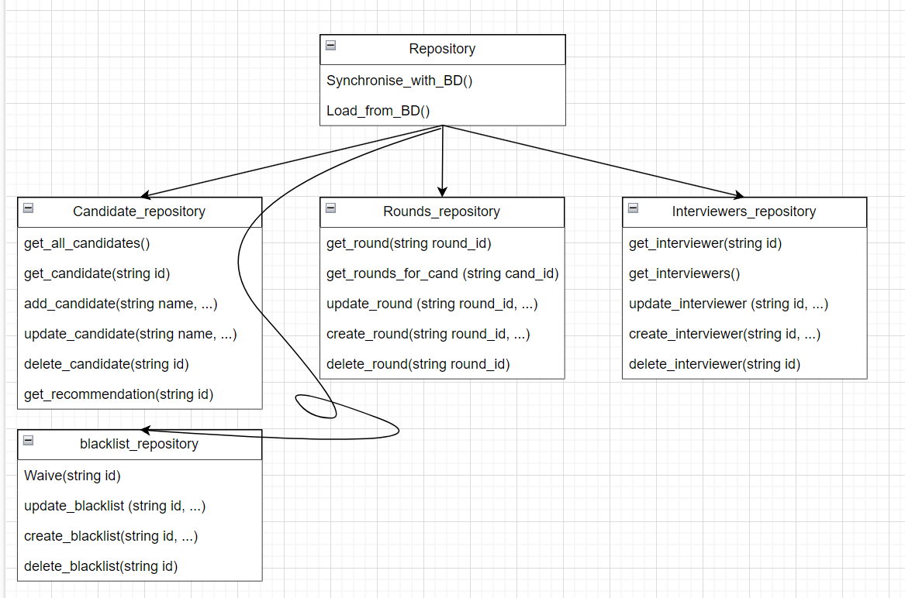

# Политанский Александр 253505
### Курсовой проект "Программное средство для девочки-hrочки"

***Описание:***
Программное средство для девочки-hrочки - это программное обеспечение, предназначенное для рутинной работы с кандидатами при приёме на работу. Оно позволяет автоматизировать частые процедуры, хранит нужные данные, облегчает работу с кандидатами и даёт рекомендации. 

***Цель проекта:***
Получить опыть разработки в ООП парадигме (и потрогать питона) :)

## 1. Модели данных:

### Модель Candidate:
- candidate_id (string): Уникальный идентификатор кандидата.
- interview_rounds (list of string): Cписок раундов интервью назначенных/пройденных кандидатом.
- name (string): Имя кандидата.
- yoe (integer): Полное количество лет опыта опыта кандидата.
- email (string): Aдрес электронной почты кандидата.
- phone number (string): Hомер мобильного телефона кандидата.
- linked in (string): Cсылка на профиль кандидата в сети linked in.
- birthdate (datetime): Дата рождения кандидата.
- address (string): Адрес проживания кандидата.
- is_blacklisted (bool): Находится ли кандидат в shadow бане.
- notes (string): Дополнительная информация о кандидате по усмотрению девочки-hrочки.

### Модель Interview_round:
- round_id (string): Уникальный идентификатор раунда собеседования.
- name (string): Название раунда собеседования.
- interviewers_id (list of string): Уникальные идентификаторы собеседующих.
- mark (list of integer): Оценка, полученная кандидатом по результатам раунда собесодавания.
- type (string): Тип раунда собеседования.
- date (datetime): Дата, на которую назначен раунд собеседования (для будущих).
- format (string): Формат (онлайн/офлайн/phone screen) раунда собеседования.
- status (string): Статус (пройдено/запланировано) раунда собеседования.

### Модель Interviewer:
- interviewer_id (string): Уникальный идентификатор собеседующего.
- name(string): Имя собеседующего.
- title (string): Должность собеседующего.
- email (string): Aдрес электронной почты собеседующего.
- weight (double): Вес оценки собеседующего.

### Модель blacklist:
- candidate_id (string): Уникальный идентификатор кандидата в бане.
- expiration_date (datetime): Дата истекания бана.
- waivable (bool): Возможность досрочного снятия бана.
- reason (string): Краткое описание причины попадания в бан.
- decision_maker (string): Имя, должность того кто отправил в бан.

Все модели используют строковый тип данных для идентификаторов, что позволяет им быть гибкими, использовать ObjectID() для генерации идентификаторов и иметь структуру для потенциального хранения их в MongoDB.
Модель Candidate хранит базовую информацию о кандидате.
Модель Interview_round хранит основную информацию о раунде собеседования.
Модель Interviewer хранит основную информацию о собеседующем.
Модель blacklist хранит дополнительную информации о бане кандидата.

## 2. Бизнес-логика:

## 2.1. Repository:
- Репозиторий - класс, содержащий хранилища данных (по одному для каждой модели). Его основные функции - продоставление доступа к классам которые он содержит и внесение изменений, сделанных локально в базу данных или загрузка данных из базы данных.

candidates_repository, rounds_repository, interviews_repository, blacklist_repository - Репозитории, которые реализуют бизнес-логику конкретной модели данных.

candidates_repository:

get_all_candidates(): Возвращает список всех кандидатов.
get_candidate(id string): Возвращает информацию о конкретном кандидате.
add_candidate(name string, *необязательные параметры): Добавляет нового кандидата.
update_candidate(id string, *необязательные параметры): Обновляет информацию о кандидате.
delete_candidate(id string): Удаляет кандидата.
get_recommendation(id string): Советует следует ли нанять кандидата.

rounds_repository:

get_round(string round_id): Возвращает информацию о раунде собеседования.
get_rounds_for_candidate(string candidate_id): Возвращает все раунды собеседования кандидата.
update_round(string round_id, *необязательные параметры): Изменяет информацию о раунде собеседования.
create_round(string candidate_id, *необязательные параметры): Создает раунд собеседования для кандидата с переданным id.
delete_round(string round_id): Удаляет информацию о раунде собеседования.

interviewers_repository:

get_interviewer(string round_id): Возвращает информацию о собеседующих в раунде чей id передан.
get_interviewers(): Возвращает информацию о всех доступных собеседующих.
update_interviewer(string id): Обновляет информацию о собеседующем.
create_interviewer(string id): Создает профиль собеседующего.
delete_interviewer(string id): Удаляет профиль собеседующего.

blacklists_repository:

Waive(string id): Приостанавливает бан кандида с id.
update_blacklist(string id): Обновляет информацию о бане.
create_blacklist(string id): Создает бан.
delete_blacklist(string id): Удаляет бан.
